# Thông tin về project
### Họ tên: Nguyễn Tống Anh Quân
### MSSV: 21006171
### GVHD: Thầy Võ Văn Hải
### Trường Đại Học Công Nghiệp Tp.HCM - IUH

## Mô tả project
I.Mục tiêu của bài tập lớn: Mục tiêu của bài tập lớn này là phát triển một hệ thống website việc làm sử dụng ngôn ngữ lập trình Java, đặc biệt là thông qua các công nghệ phát triển web như Spring Boot, cơ sở dữ liệu MariaDB, và các công nghệ frontend như HTML, CSS, JSP và JavaScript. Website này sẽ phục vụ nhu cầu kết nối giữa nhà tuyển dụng và ứng viên tìm việc, cung cấp các công cụ tìm kiếm việc làm, đăng tin tuyển dụng, và nộp đơn trực tuyến. Hệ thống sẽ hỗ trợ các tính năng quản lý cho cả nhà tuyển dụng và ứng viên, tạo ra một nền tảng tiện lợi và hiệu quả trong việc tìm kiếm và đăng tuyển dụng.

II. Công nghệ được sử dụng
**Frontend**:
- HTML, CSS, JS, JSP: Các công nghệ cơ bản được sử dụng để phát triển giao diện người dùng của ứng dụng.
- Bootstrap 5: Thư viện CSS mạnh mẽ giúp thiết kế giao diện dễ dàng, phản hồi linh hoạt trên mọi thiết bị.

**Backend**:
- Java: Dự án được phát triển bằng ngôn ngữ lập trình Java, nổi bật với tính linh hoạt và khả năng phát triển ứng dụng quy mô lớn.
- Spring Boot: Sử dụng Spring Boot, một framework Java mã nguồn mở giúp tạo ứng dụng độc lập, dễ triển khai và bảo trì.
- Maven: Maven là công cụ xây dựng chính được sử dụng trong dự án này, giúp tự động hóa quy trình xây dựng, kiểm thử và triển khai ứng dụng một cách dễ dàng và hiệu quả.

## Diagram
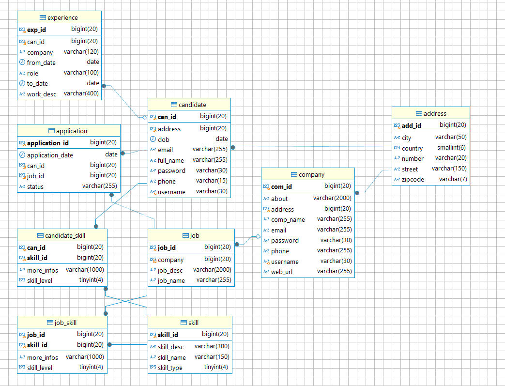

- Một số thay đổi trong database:
- Bổ sung User nameand password cho Company và Candidate để thực hiện chức năng đăng nhập đăng ký tài khoản trước khi đăng tin tuyển dụng hoặc tìm kiếm việc làm.
- Bổ sung bảng Applycation để lưu thông tin ứng viên đã ứng tuyển vào công việc nào.

- Thiết lập `resources/application.properties`

   ```
    spring.datasource.url=jdbc:mariadb://localhost:3306/www_week5_works
    spring.datasource.username=root
    spring.datasource.password=sapassword
    spring.datasource.driver-class-name=org.mariadb.jdbc.Driver
    spring.jpa.hibernate.ddl-auto=update
    spring.jpa.show-sql=true
   ```

## Chức năng
#### **Ứng viên:**
- Đăng ký/Đăng nhập
- Xem các bài tuyển dụng
- Gợi ý công việc phù hợp với kỹ năng
- Ứng tuyển công việc
- Gợi ý các kỹ năng cần học

#### **Công ty:**
- Đăng ký/Đăng nhập
- Đăng thông tin tuyển dụng
- Tìm kiếm ứng viên có kỹ năng phù hợp
- Xem thông tin ứng viên đã ứng tuyển

## GUI - COMPANY (Khi đăng nhập với tài khoản Company)
### 1) Home Page

### 2) Trang Đăng Ký Tài Khoản Company
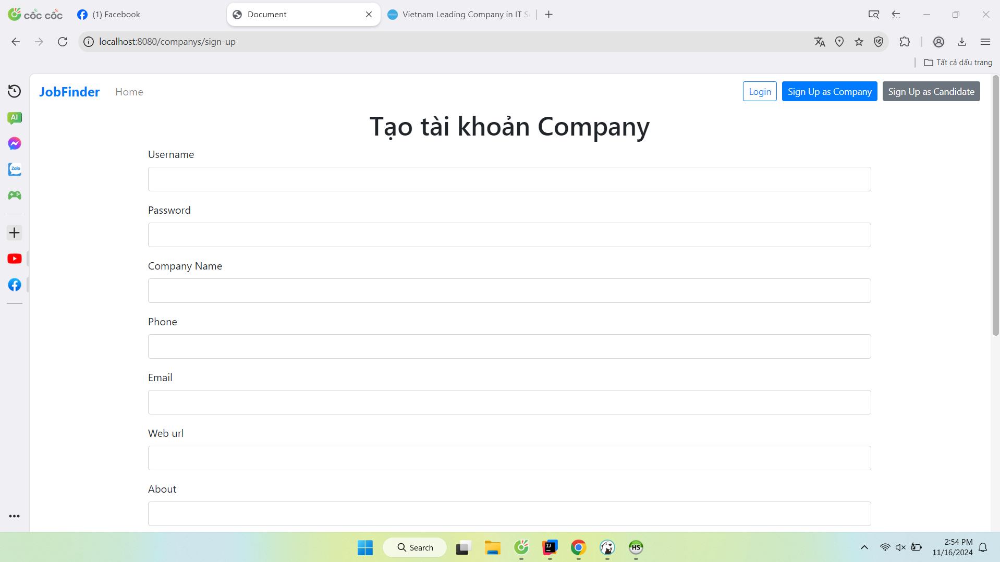
### 3) Trang Đăng Ký Tài Khoản Candidate
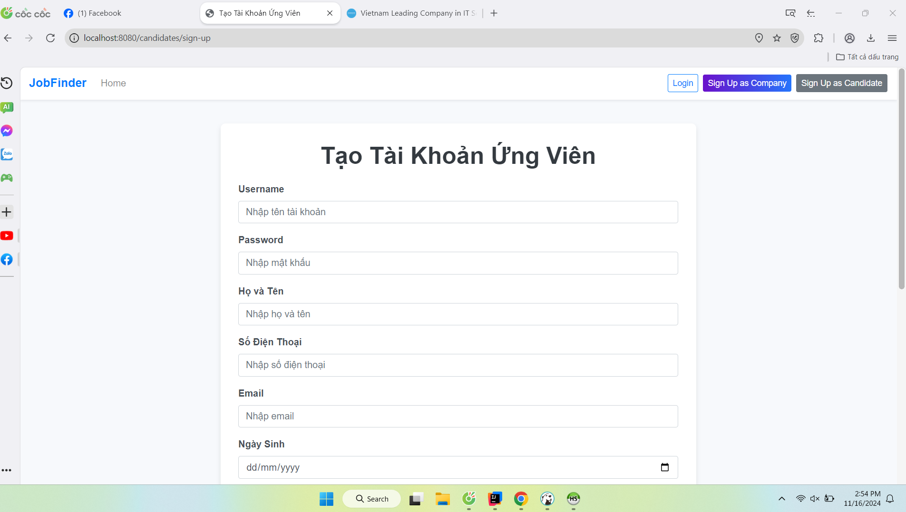
### 4) Trang Đăng Nhập
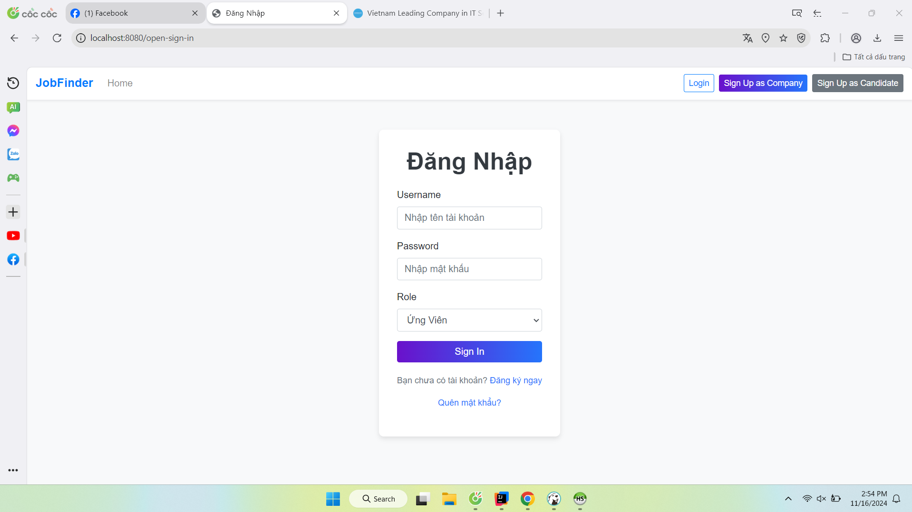
### 5) Home Page của Company (Mặc định sẽ hiểu thị các job mà website đề xuất)

### 6) Company post job (compnay sẽ tiến hành đăng tin tuyên dụng taị đây)
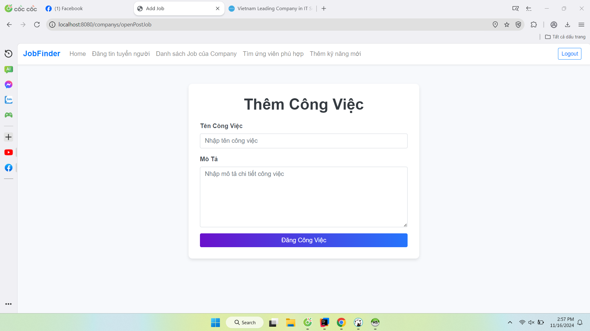
### 7) Công ty thêm 1 skill mà công ty yêu cầu cho job

### 8) Công ty xem danh sách job đã post và có thể bổ sung kỹ năng mà công ty yêu cầu cho job

### 9) Công ty thêm kỹ năng yêu cầu cho job
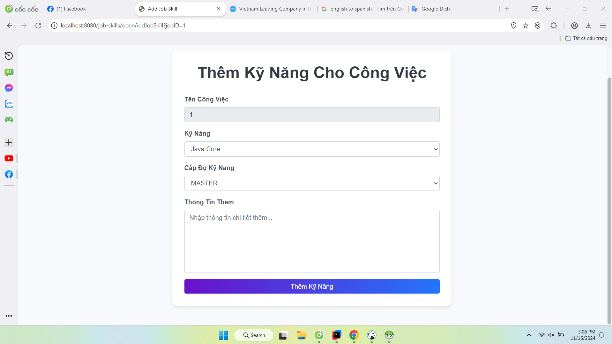
### 10) Tìm kếm ứng viên cho job (Hệ thống se gợi ý các ứng viên phù hợp với công việc dựa vào kỹ năng mà công ty yêu cầu, và đia điểm làm việc)
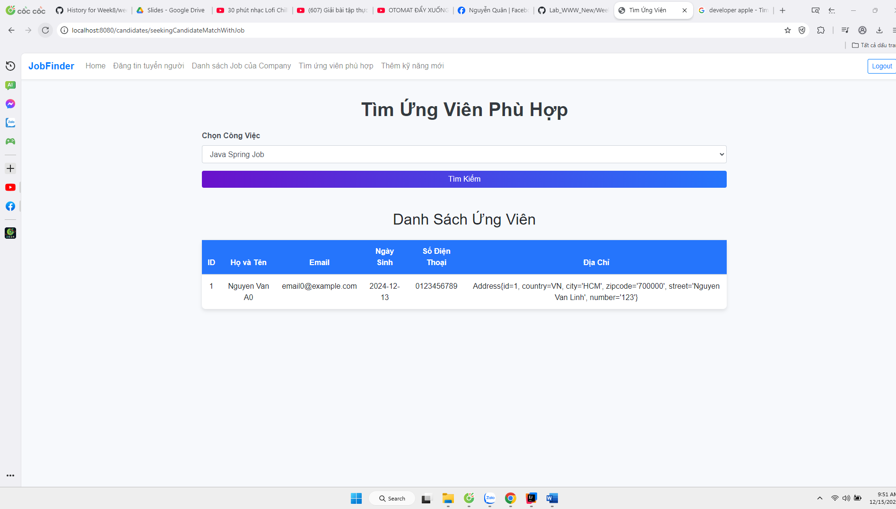

## GUI - CANDIDATE (Giao diện khi đăng nhập với tài khoản Candidate)
### 1) Home Page (Mặc định sẽ hiểu thi các công việc mà website đề xuất)

### 2) Công việc phù hợp với kỹ năng của candidate (Website sẽ gợi ý các công việc phù hợp với kỹ năng mà candidate đã học và dựa vào địa chỉ của candidate so với địa chỉ làm việc)
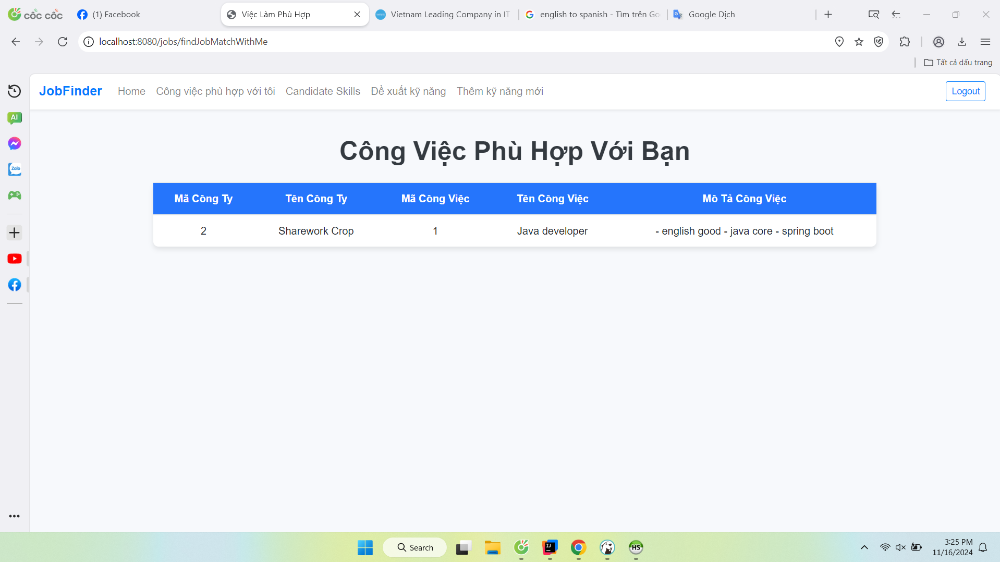
### 4) Danh sách kỹ năng candidate đã học (Candidate có thể xem lại danh sách kỹ năng mà mình đã học và thêm kỹ năng mới)
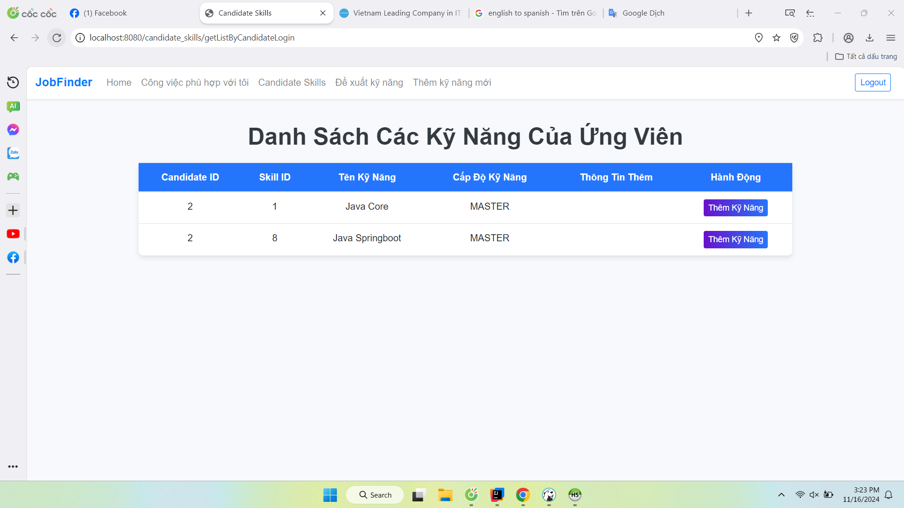
### 5) Candidate thêm kỹ năng mình đã học
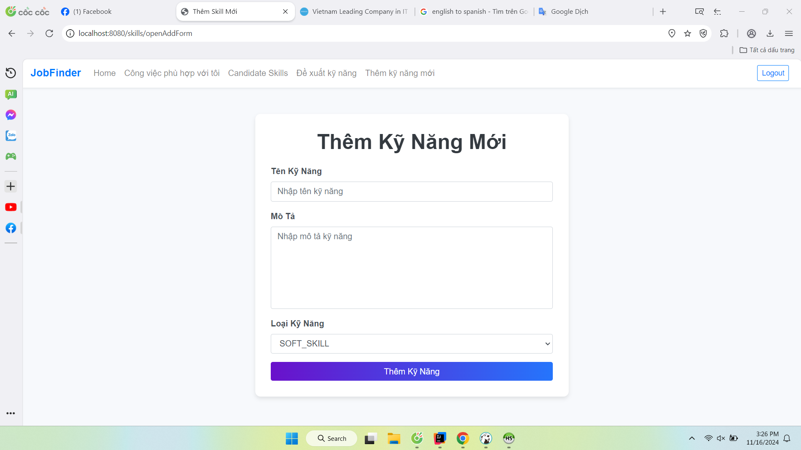
### 6) Gợi ý ký năng candidate cần học (Dựa vào các yêu cầu của công việc mà company đưa ra, hệ thống sẽ gợi ý các kỹ năng mà candidate cần học)
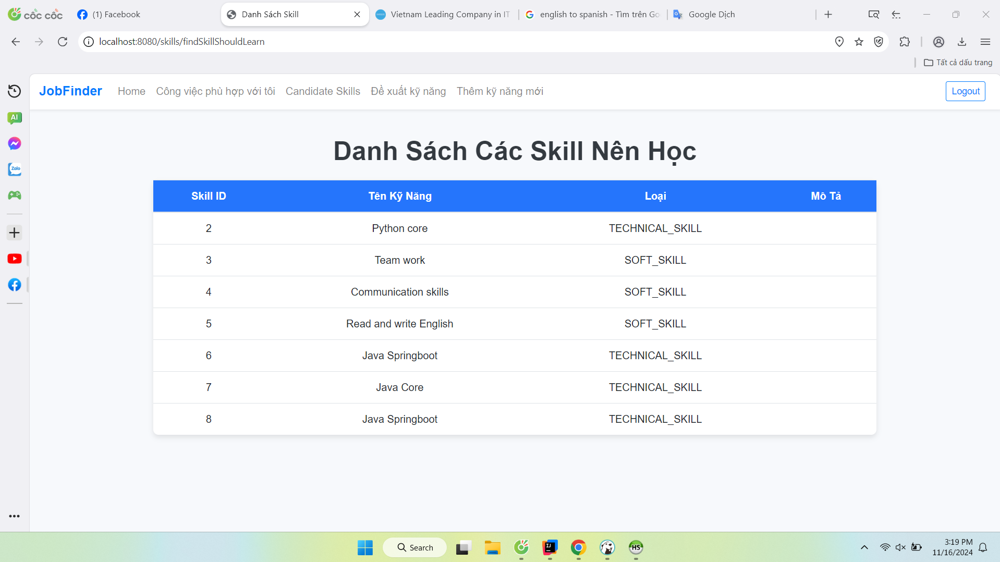
