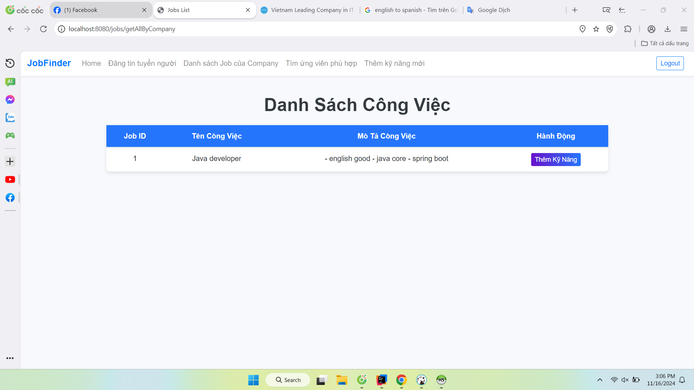

# Thông tin về project
### Họ tên: Nguyễn Tống Anh Quân
### MSSV: 21006171
### GVHD: Thầy Võ Văn Hải
### Trường Đại Học Công Nghiệp Tp.HCM - IUH

## Mô tả project
### I.Mục tiêu của bài tập lớn: Mục tiêu của bài tập lớn này là phát triển một hệ thống website việc làm sử dụng ngôn ngữ lập trình Java, đặc biệt là thông qua các công nghệ phát triển web như Spring Boot, cơ sở dữ liệu MariaDB, và các công nghệ frontend như HTML, CSS, JSP và JavaScript. Website này sẽ phục vụ nhu cầu kết nối giữa nhà tuyển dụng và ứng viên tìm việc, cung cấp các công cụ tìm kiếm việc làm, đăng tin tuyển dụng, và nộp đơn trực tuyến. Hệ thống sẽ hỗ trợ các tính năng quản lý cho cả nhà tuyển dụng và ứng viên, tạo ra một nền tảng tiện lợi và hiệu quả trong việc tìm kiếm và đăng tuyển dụng.
## II. Công nghệ được sử dụng
**Frontend**:
- HTML, CSS, JS, JSP: Các công nghệ cơ bản được sử dụng để phát triển giao diện người dùng của ứng dụng.
- Bootstrap 5: Thư viện CSS mạnh mẽ giúp thiết kế giao diện dễ dàng, phản hồi linh hoạt trên mọi thiết bị.
**Backend**:
- Java: Dự án được phát triển bằng ngôn ngữ lập trình Java, nổi bật với tính linh hoạt và khả năng phát triển ứng dụng quy mô lớn.
- Spring Boot: Sử dụng Spring Boot, một framework Java mã nguồn mở giúp tạo ứng dụng độc lập, dễ triển khai và bảo trì.
- Maven: Maven là công cụ xây dựng chính được sử dụng trong dự án này, giúp tự động hóa quy trình xây dựng, kiểm thử và triển khai ứng dụng một cách dễ dàng và hiệu quả.

## Diagram

## GUI - COMPANY
### 1) Home Page

### 2) Trang Đăng Ký Tài Khoản Company

### 3) Trang Đăng Ký Tài Khoản Candidate

### 4) Trang Đăng Nhập

### 5) Home Page của Company

### 6) Company post job

### 7) Công ty thêm 1 skill cho job

### 8) Công ty xem danh sách job đã post

### 9) Công ty thêm kỹ năng yêu cầu cho job

### 10) Tìm kếm ứng viên cho job

## GUI - CANDIDATE
### 1) Home Page

### 2) Công việc phù hợp với kỹ năng của candidate

### 4) Danh sách kỹ năng candidate đã học

### 5) Gợi ý ký năng candidate cần học 

### 6) Candidate thêm kỹ năng mình đã học
