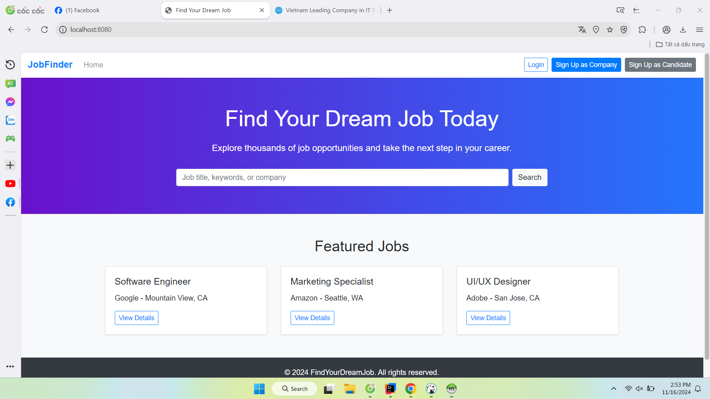
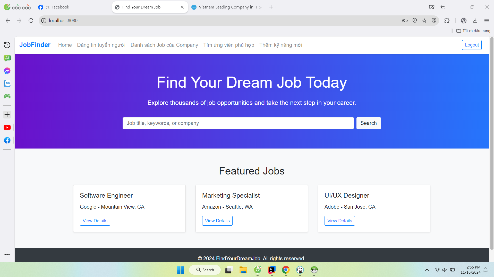
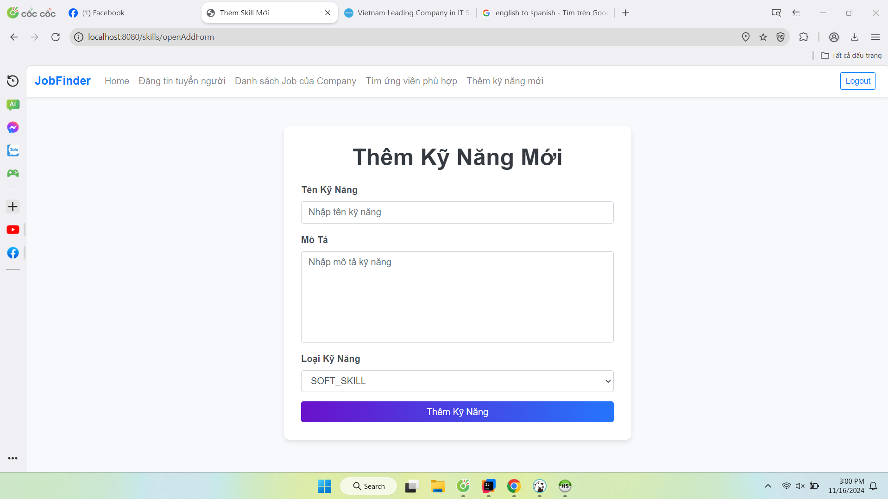
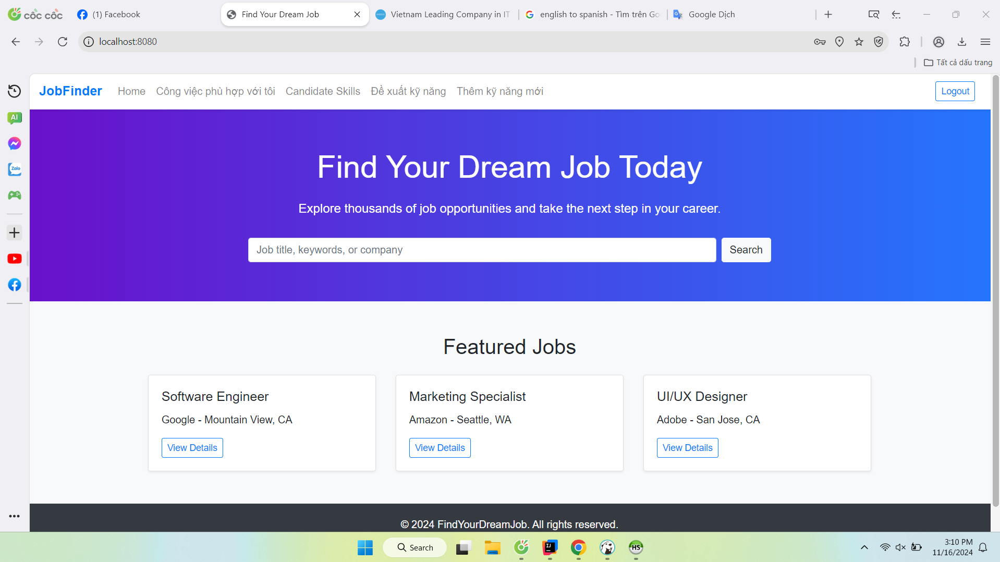

# Nguyễn Tống Anh Quân - MSSV: 21006171 - Lab WWW - Week 5 New

### SpringMVC

## GUI - COMPANY
### 1) Home Page

### 2) Trang Đăng Ký Tài Khoản Company

### 3) Trang Đăng Ký Tài Khoản Candidate

### 4) Trang Đăng Nhập

### 5) Home Page của Company

### 6) Company post job

### 7) Công ty thêm 1 skill cho job

### 8) Công ty xem danh sách job đã post

### 9) Công ty thêm kỹ năng yêu cầu cho job

### 10) Tìm kếm ứng viên cho job

## GUI - CANDIDATE
### 1) Home Page

### 2) Công việc phù hợp với kỹ năng của candidate

### 4) Danh sách kỹ năng candidate đã học

### 5) Gợi ý ký năng candidate cần học 

### 6) Candidate thêm kỹ năng mình đã học
